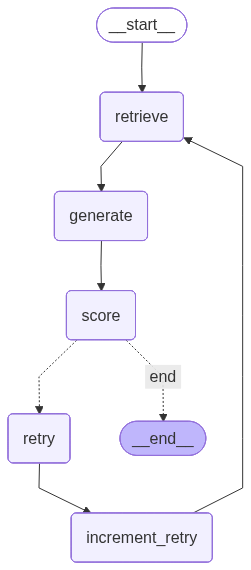

# 🤖 Self-Healing RAG Agent with LangGraph

A Self-Healing Retrieval-Augmented Generation (RAG) Agent built with LangGraph, ChromaDB, Hugging Face embeddings, and LLM-as-a-Judge evaluation. <br>
This project demonstrates how to design an agentic RAG system that can:

* Detect retrieval failures
* Diagnose why the answer is bad
* Adapt its retrieval strategy automatically
* Retry intelligently until the answer quality improves

## 🚀 Key Features

* Agentic control flow with LangGraph
* Vector search using ChromaDB
* Dense embeddings + cross-encoder reranking
* LLM-as-a-Judge scoring (faithfulness + relevance)
* Automatic self-healing retries
* Explainable healing trace
* Interactive Streamlit UI
* PDF-based document ingestion

## 🧠 What Is “Self-Healing RAG”?

Traditional RAG systems retrieve documents once and hope for the best.<br>
This agent instead:

* Retrieves documents
* Generates an answer
* Uses an LLM to judge the answer
* Diagnoses the failure reason:
  * irrelevant_docs
  * missing_context
* Applies a targeted fix:
  * increase retrieval budget
  * enable reranking
* Retries until the answer quality improves or a retry limit is reached
* This mimics how a human retrieval engineer would debug a failing RAG system.

## 🧩 Architecture Overview

``` pgsql
User Query
    ↓
Retrieve Documents
    ↓
Generate Answer
    ↓
LLM-as-a-Judge (Score + Failure Reason)
    ↓
Should Retry?
   ├─ No → END
   └─ Yes
        ↓
   Healing Strategy
        ↓
   Increment Retry Count
        ↓
   Retrieve Again (Improved)
```
## Graph Visualization



## 🧠 Failure Modes Detected

| Failure Reason | Meaning | Healing Action |
| --- | --- | --- |
| irrelevant_docs | Retrieved docs don’t match query | Enable reranking + increase budget |
| missing_context | Docs are related but insufficient | Increase retrieval budget + rerank |
| none | Answer is good | Stop execution |

## 📂 Project Structure

```bash
Self-Healing-RAG/
│
├── langgraph_agent/
│   ├── document_loader.py   # PDF loading + chunking
│   ├── retrieve_docs.py     # Embedding, retrieval, reranking, LLM judge
│   ├── nodes.py             # LangGraph nodes + state definition
│   └── graph.py             # LangGraph control flow
│
├── app.py                   # Streamlit application
└── README.md
```

## 🛠️ Tech Stack

* LangGraph – agentic workflows
* LangChain – document loading & splitting
* ChromaDB – vector database
* FastEmbed – Hugging Face embeddings
* Cross-Encoder Reranker – relevance refinement
* Google Gemini – answer generation
* Google Gemini – LLM-as-a-Judge
* Streamlit – UI

### Dependencies

* `chromadb` >= 0.4.0
* `fastembed` >= 0.7.4
* `google-generativeai` >= 0.3.0
* `hf-xet` >= 1.2.0
* `ipykernel` >= 7.1.0
* `langchain-community` >= 0.4.1
* `langchain-huggingface` >= 1.2.0
* `langchain-text-splitters` >= 1.1.0
* `langgraph` >= 1.0.5
* `numpy` >= 2.4.0
* `pypdf` >= 6.5.0
* `python-dotenv` >= 1.1.0
* `sentence-transformers` >= 5.2.0
* `streamlit` >= 1.52.2

## 🧪 How the LLM-as-a-Judge Works

The evaluator LLM receives:

* User query
* Retrieved documents
* Generated answer

It returns structured JSON:

```json
{
  "relevant_docs": true,
  "sufficient_context": false,
  "score": 0.62
}
```


This output directly controls the agent’s next action.

## 🧾 State Managed by the Agent

```python
class RAGState(TypedDict):
    text: List[str]
    query: str
    retrieved_docs: List[str]
    retrieval_mode: str
    retrieval_budget: int
    answer: str
    score: float
    failure_reason: str
    retry_count: int
    max_retries: int
    healing_trace: List[str]
```

This explicit state design makes the system:

* debuggable
* explainable
* extensible

## ▶️ Running the App

### 1️⃣ Install dependencies

```bash
uv sync
```

(This installs all dependencies from `pyproject.toml` into a virtual environment.)

### 2️⃣ Run Streamlit

```bash
uv run streamlit run app.py
```

### 3️⃣ Usage

1. Enter your Gemini API key
2. Upload a PDF document
3. Ask questions about the document
4. Watch the agent:

* retrieve
* evaluate
* self-heal
* retry

## 🔍 Example Healing Trace

```yaml
Irrelevant docs → enabled rerank + increased retrieval budget by 2
Missing context → increased retrieval budget by 3 + rerank
```

This makes the agent’s reasoning transparent and inspectable.

## 🎯 Why This Project Matters

This repo demonstrates real-world RAG engineering, not toy demos:

* Explicit failure modeling
* Adaptive retrieval strategies
* Agentic decision-making
* LLMs used for control, not just generation

It is ideal for:

* Portfolio projects
* RAG system interviews
* Agentic AI experimentation
* Production design discussions

## 🔮 Possible Extensions

* Query rewriting
* Hallucination detection
* Hybrid BM25 + dense retrieval
* Multi-document routing
* LangSmith tracing
* Evaluation dataset logging


## License

Project licensed under the MIT License.

---

## Observations

### 1. A Little About LangGraph

LangGraph = *“A directed graph where nodes mutate shared state, and edges depend on that state.”*

#### Core Mental Model (Burn This In)

* Every LangGraph project answers four questions:
* What is my state?
* Which nodes modify which parts of the state?
* Which decisions depend on the state?
* When does the graph stop?
